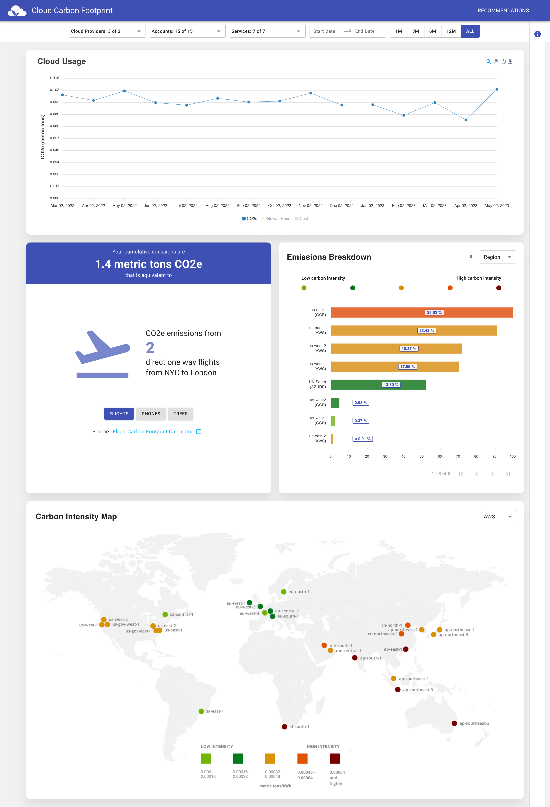

# <div style="text-align: center;">Our Outcomes</div>
## Execution with mocked data:
### Steps to execute:
1) Create a repository for our project team in GitHub.
2) Clone that repository locally in our local machine by using the command: 
  ```shell
  git clone https://github.com/OU-CS5213/CS5213-Summer23-Project7.git
  ```
3) Then clone the cloud-carbon-footprint repository into our code space which is in local machine. Command to do this operation: 
  ```shell
  git clone https://github.com/cloud-carbon-footprint/cloud-carbon-footprint.git
  ```
4) Change the current working directory to cloud-carbon-footprint, we can do that using: 
  ```shell
  cd cloud-carbon-footprint
  ```
5) Install node.js in our machine. node.js is a javascript framework which is used to develop web applications( both backend and frountend ). In you're using a macbook, then you can install node.js by the below command: 
  ```shell
  brew install node
  ```
6) If brew is not already installed in the system, install it using this command: 
  ```shell
  /bin/bash -c "$(curl -fsSL https://raw.githubusercontent.com/Homebrew/install/HEAD/install.sh)"
  ```
7) Install yarn package manager in our machine to use yarn commands that will be used to run the application. Command to get yarn: 
  ```shell
  brew install yarn
  ```
9)  Install required node modules using this command: 
  ```shell
  yarn install
  ```
10)   Now to execute the application with mocked data, run this command: 
  ```shell
  yarn start-with-mock-data
  ```
11)   Now the web server will be started and a web page with all the statistics about carbon footprint with mocked data, opens in the default web browser.
12)   Take screenshot of the whole page.

### Challenges we faced during this process:
1) While trying to install node modules required to execute the application using `yarn install`, got an error because my machine doesn't have yarn package manager. I fixed by installing yarn using brew in my machine. I have included it as steps for execution.
2) Also, while trying to start the application we got an error that node.js is not there my system and we fixed it by installing node.js framework using brew.

### Outcome:


### Explanations
1) The first part of the screenshot shows a graph that shows data of CO2 from the last one until now i.e from Mar 2022 to May 2023.
2) Then, we have 2 visualization, the first one shows the cummulative emissions, which equals 1.4 metric tons of CO2, the second visualization is bar plot which shows carbon intensity by regions.
3) Then finally, we have a world map marked with carbon intensity at different locations by colors.
